# Lec1: Intro

## 1.1 数据库系统概述

### 1.1.1 数据库的四个基本概念

#### 数据
数据是指具有一定的**语义**(semantic)含义，并且**可以被记录下来**的已知信息。
语义是指数据所表达的意义和内容。数据可以是数字、文本、图像、音频等各种形式的信息。
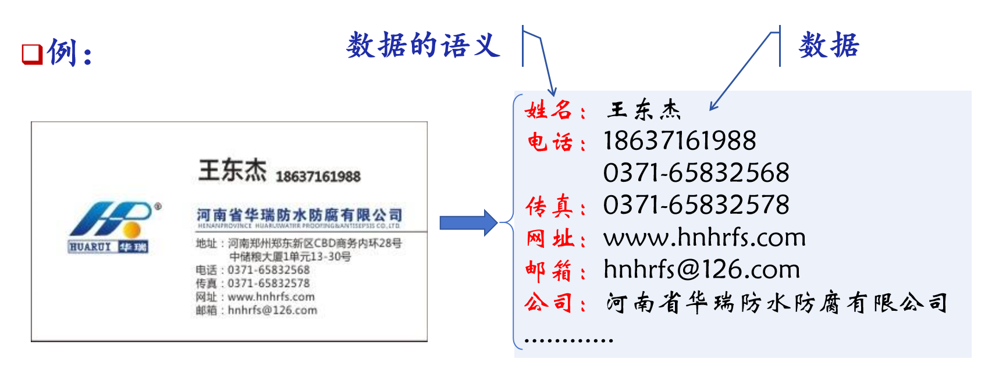
信息是数据的内涵，数据是信息的载体。
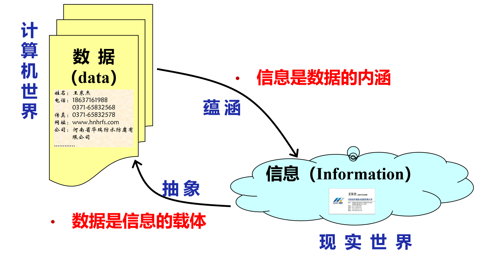
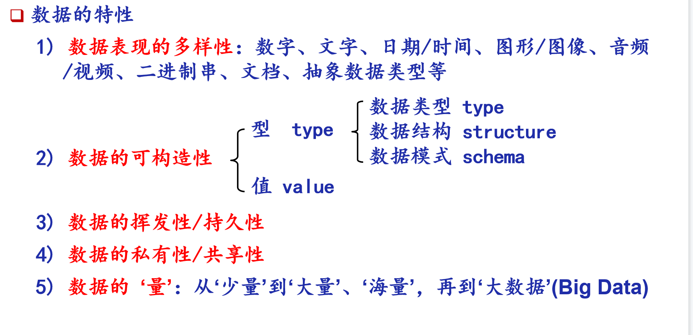

数据特性的变化趋势：
1. 数据的量：少量 → 大量 → 海量（大数据 Big Data）
2. 数据的结构：简单 → 复杂 → 无结构
3. 数据的服务范围：私有 → 共享
4. 数据在软件中的地位：附属地位（以程序为主体）→ 主导地位（以数据为中心）

#### 数据库 (DataBase, DB)
是指长期储存在计算机内、有组织的、可共享的大量数据的**集合**。
数据库中的数据按一定的**数据模型**组织、描述和储存，具有较小的数据冗余(data redundancy)、较高的数据独立性(data independency)和易扩展性(scalability)，并可为各种用户共享。
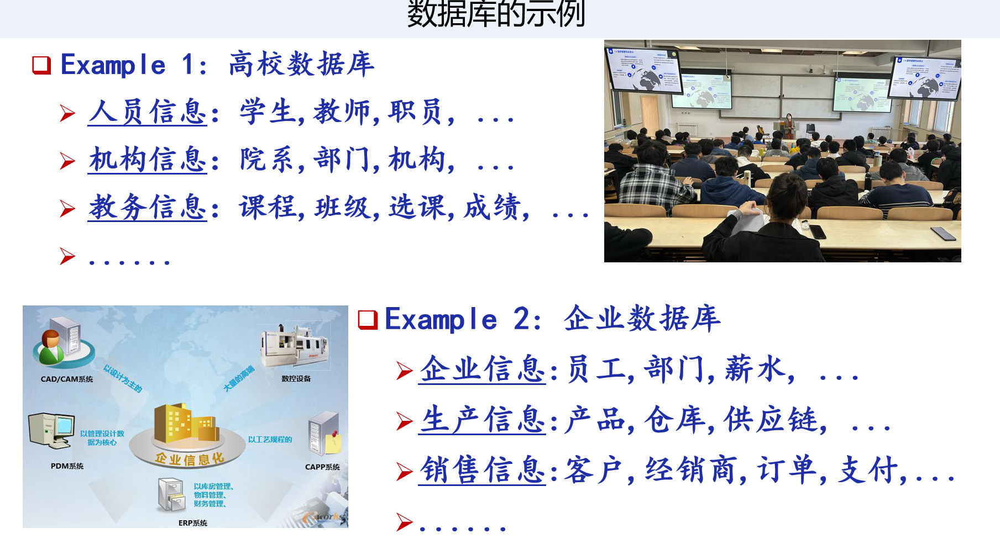

#### 数据库管理系统 (Database Management System, DBMS)
位于用户（应用程序）与数据库（操作系统）之间的一层**数据管理软件**，是一种用于管理数据库的大型系统软件。
DBMS是在文件管理系统的基础上发展起来的，它区别于其它计算机软件系统的特点在于：
- 能对持久性数据进行管理
- 能对大量数据进行有效存取
- 可实现数据共享（众多用户可使用同一数据）

DBMS的作用：科学地组织和存储数据、高效地获取和维护数据；是数据库应用程序与数据库之间的**访问接口**；在保证数据安全、可靠的同时，提高数据库应用时的简明性和方便性。

功能：
- 数据定义功能（提供DDL，定义数据模式 data schema）
- 数据组织、存储和管理（确定存储方式，提供多种存取方法：顺序扫描、索引扫描、HASH扫描等）
- 数据操纵功能（提供DML，实现查询、插入、删除、修改）
- 数据库事务管理和运行管理（安全性、完整性、并发控制、故障恢复）
- 数据库建立和维护（初始数据加载与转换、转储、恢复、重组、性能监视）
- 其他功能（与网络通信、异构数据库互访/互操作）

数据子语言：
- 数据定义语言(DDL)：定义数据库的结构和模式 data definition language
- 数据操纵语言(DML)：对数据库中的数据进行查询、插入、更新和删除等操作 data manipulation language
- 数据控制语言(DCL)：控制数据库的访问权限和安全性 data control language

数据子语言的使用方式：
- **交互式命令语言**（自含型/自主型）：能在终端上即席操作，可以命令行交互方式或批处理方式独立运行
- **宿主型语言**：需要嵌入到某种宿主语言中（Fortran、Cobol、C/C++，到现在的Java、Python等），在程序中使用数据子语言来访问数据库

统一的数据子语言：**SQL**(Structured Query Language)，是一种标准的关系数据库查询语言，包含DDL、DML和DCL的功能。

#### 数据库系统 (Database System, DBS) 和数据库应用系统
数据库系统(DBS)：由数据库、数据库管理系统、数据库管理员、**支撑系统运行所必须的系统软件和硬件平台**组成的存储、管理、处理和维护数据的系统。

数据库应用系统(DAS)：由数据库系统、应用开发工具、应用系统、数据库用户组成的计算机系统。

在不引起混淆的情况下，常常把两者都统称为"数据库系统"。

数据库系统的构成：数据库、数据库管理系统、数据库管理员(DBA)、系统硬件平台与系统软件平台、应用系统与应用开发工具、数据库用户。

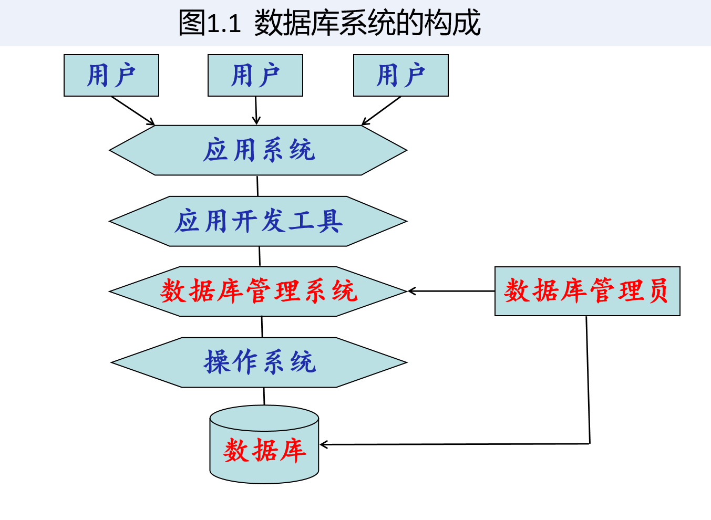

#### 数据库用户
是指规划、设计、建立、访问、管理、维护数据库的人员。

通常存在以下三类数据库用户：
- 数据库管理员 (DataBase Administrator, DBA)：负责数据库的规划、设计、建立、管理、维护、监视的专职人员。
- 应用开发人员 (包括系统分析员、数据库设计人员、应用程序员)
- 最终用户 (End users)：通过应用系统访问使用数据库的人员。

---

### 1.1.2 数据管理技术的产生和发展

**数据管理**：是指对数据进行分类、组织、编码、存储、检索和维护，是数据处理的中心问题。
**数据处理**：是指对各种数据进行收集、存储、加工和传播的一系列活动的总和.

数据管理技术的发展动力：应用需求的推动、计算机硬件的发展、计算机软件的发展。

#### 数据管理技术的发展过程

| | 人工管理阶段 | 文件系统阶段 | 数据库系统阶段 |
|---|---|---|---|
| **时间** | 20世纪50年代中之前 | 50年代末--60年代中 | 60年代末--现在 |
| **应用背景** | 科学计算 | 科学计算，数据管理 | 大规模数据管理 |
| **硬件背景** | 无直接存取存储设备 | 磁盘，磁鼓 | 大容量磁盘，磁盘阵列 |
| **软件背景** | 没有操作系统 | 有文件系统 | 有数据库管理系统 |
| **处理方式** | 批处理 | 联机实时处理、批处理 | 联机实时处理、分布处理、批处理 |
| **数据的管理者** | 用户（程序员） | 文件系统 | 数据库管理系统 |
| **数据面向对象** | 某一应用程序 | 某一应用 | 现实世界（部门、企业、跨国组织等） |
| **数据共享程度** | 无共享，冗余度极大 | 共享性差，冗余度大 | 共享性高，冗余度小 |
| **数据独立性** | 不独立，完全依赖于程序 | 独立性差 | 具有较高的物理独立性和一定的逻辑独立性 |
| **数据结构化** | 无结构 | 记录内有结构，整体无结构 | 整体结构化，用数据模型描述 |
| **数据控制能力** | 应用程序自己控制 | 应用程序自己控制 | 由DBMS提供统一控制 |

**人工管理阶段**：数据不保存，无共享，数据无结构，完全依赖于程序。

**文件系统阶段**：数据可长期保存，但共享性差、冗余度大，独立性差，只能记录内有结构而整体无结构。文件系统无法提供完整统一的数据管理功能和并发控制等多用户数据共享功能。

文件管理存在的问题：
- 数据存储：冗余存储(redundancy)、数据的不一致性(data inconsistency)、完整性约束(integrity constraints)
- 数据访问：缺少标准的数据访问接口、数据更新操作的原子性(atomicity of updates)
- 多用户并发访问的隔离、并发控制、故障恢复
- 数据安全：用户身份识别，访问控制

#### 数据库系统分类

- **关系数据库 RDBMS**：Oracle, DB2, SQL Server, MySQL, PostgreSQL, ...
- **键值数据库 Key-value stores**：Redis, Memcached, Amazon DynamoDB, ...
- **文档数据库 Document-oriented stores**：MongoDB, Couchbase, CouchDB, ...
- **图数据库 Graph-oriented DBMS**：Neo4j, OrientDB, ...
- **列数据库 Wide column store**：Cassandra, HBase, ...
- **其他**：面向对象数据库、XML数据库、RDF数据库、时序数据库、空间数据库、向量数据库等

---

### 1.1.3 数据库系统的特点

与人工管理和文件系统相比，采用数据库系统来实现数据管理具有以下特点：

#### 数据结构化
数据的整体结构化是数据库的主要特征之一，也是数据库系统与文件系统的**本质区别**。
- **整体结构化**：面向全组织（集成性：采用统一的数据结构，建立全局统一的数据模式）
- 不仅数据内部结构化，整体是结构化的，数据之间具有联系
- 数据记录可以变长，数据的最小存取单位是数据项
- 数据的组织结构、联系方式、存取方法用"数据模型"描述，无需应用程序定义

#### 数据的共享性高，冗余度低且易扩充
- **数据共享**：可供多个应用程序使用，可在已有的数据库系统上开发新的应用程序，可向外界提供信息服务
- **数据冗余**：同一个数据在系统中的不同地方出现了重复存储
- **数据一致性**：系统中同一数据的不同出现应保持相同的值
- 数据共享的好处：减少数据冗余，节约存储空间；避免数据之间的不相容性与不一致性；使系统易于扩充

#### 数据独立性高
**数据独立性**是指数据库中的数据与使用这些数据的应用程序之间的互不依赖性，即数据或数据结构的改变不会导致对应用程序的修改，反之亦然。
- **物理独立性**：用户的应用程序与数据库中数据的物理存储相互独立。当数据的物理存储改变了，应用程序不用改变。
- **逻辑独立性**：用户的应用程序与数据库的逻辑结构相互独立。数据的逻辑结构改变了，应用程序不用改变。

在DBMS中，数据独立性由**三级模式**及它们之间的**二级映像**功能来保证。

#### 数据由数据库管理系统统一管理和控制
DBMS提供的数据控制功能包括：
- **安全性(Security)保护**：保护数据以防止不合法使用造成的数据泄密和破坏
- **完整性(Integrity)检查**：保证数据的正确性、有效性和相容性
- **并发(Concurrency)控制**：对多用户的并发操作加以控制和协调，防止相互干扰而得到错误的结果
- **数据库恢复(Recovery)**：将数据库从错误状态恢复到某一已知的正确状态

---

## 1.2 数据模型

数据模型是指对现实世界中数据的**抽象和描述**，是数据库系统中用于组织、存储和管理数据的一种结构化方式。
数据模型应满足三方面要求：
- 能比较真实地模拟现实世界
- 容易为人所理解
- 便于在计算机上实现

数据模型是数据库系统的核心和基础

### 1.2.1 两类数据模型

我们用建立在不同抽象层次上的"数据模型"来表示每一步转化的结果（两大类、共三种类型的数据模型）：
- **概念数据模型 (conceptual data model)**，又简称"概念模型"
- **逻辑数据模型 (logic data model)**，又简称"逻辑模型"
- **物理数据模型 (physical data model)**，又简称"物理模型"

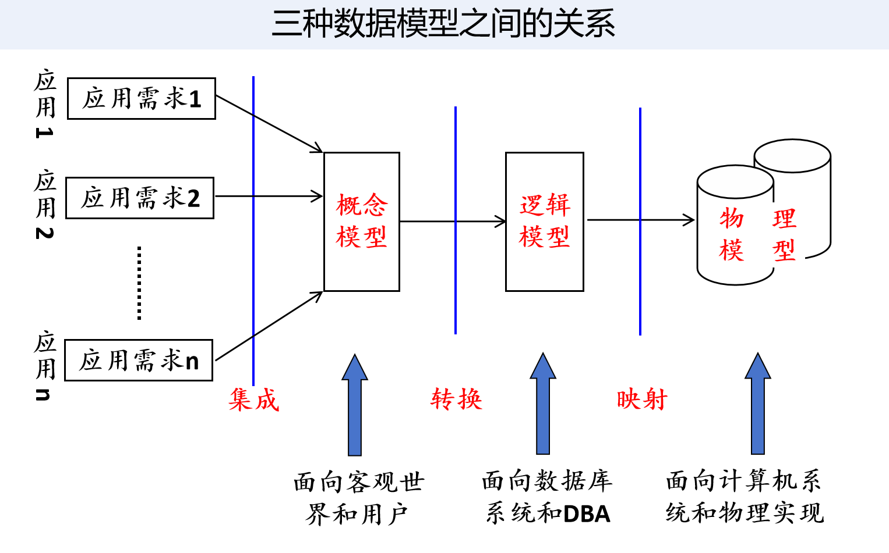

| 数据模型 | 说明 | 面向对象 |
|---|---|---|
| 概念模型（信息模型） | 按用户的观点来对数据和信息建模，用于数据库设计 | 面向客观世界和用户 |
| 逻辑模型 | 按计算机系统的观点对数据建模，用于DBMS实现（包括网状、层次、关系、面向对象等） | 面向数据库系统和DBA |
| 物理模型 | 对数据最底层的抽象，描述数据在系统内部的表示方式和存取方法 | 面向计算机系统和物理实现 |

**两步抽象过程**：
1. 将现实世界中的客观对象抽象为概念模型（将现实世界抽象为信息世界），由数据库设计人员完成
2. 把概念模型转换为特定DBMS支持的逻辑模型&物理模型（将信息世界转换为机器世界），由数据库设计人员和数据库设计工具协助完成，物理模型由DBMS完成

### 1.2.2 概念模型

将现实世界中的客观对象抽象为概念模型，将现实世界抽象为信息世界，概念模型用于信息世界的建模。

用途：
- 是现实世界到机器世界的一个中间层次
- 是数据库设计的有力工具
- 是数据库设计人员和用户之间进行交流的语言

对概念模型的基本要求：
- 较强的语义表达能力
- 简单、清晰、易于用户理解

概念模型的特点：
- 侧重于对客观世界中复杂事物的结构描述及它们之间的内在联系的刻划，不涉及具体的描述细节和物理实现因素
- 是一种面向客观世界和用户的模型，与DBMS及计算机实现无关

#### 信息世界中的基本概念

**实体(Entity)**：客观存在并可相互区别的事物称为实体。可以是具体的人、事、物或抽象的概念。每一个实体有一个**实体名**，同类实体具有相同的实体名。

**属性（Attribute）**：实体具有的**某一特性**称为属性。一个实体可以由若干个属性来刻画。每一个属性有一个**属性名**，在同一个实体内属性名互不相同。同类实体有相同的属性组成，但在同名属性上的取值可能互不相同。

**联系（Relationship）**：现实世界中事物内部以及事物之间的联系，在信息世界中反映为实体（型）内部的联系和实体（型）之间的联系。每一个联系有一个**联系名**。

**实体型（Entity Type）**：用实体名及其**所有属性名的集合**来抽象和刻画同类实体。

**实体值（Entity Value）**：实体中的属性可以有值，一个实体的所有属性值的集合被称为该实体的实体值。（也被称为实体实例，Entity Instance）

**实体集（Entity Set）**：同一类型实体的集合，称实体集。同一个实体集中的所有实体，具有相同的实体型但实体值互不相同。

**码（Key）**：唯一标识实体的属性集称为码。码也被称为**关键字**、键、标识符(Identifier)。在一个实体集中，可以通过码的取值来区分不同的实体。

#### 实体之间的联系

实体之间的联系通常是指不同实体集之间的联系。
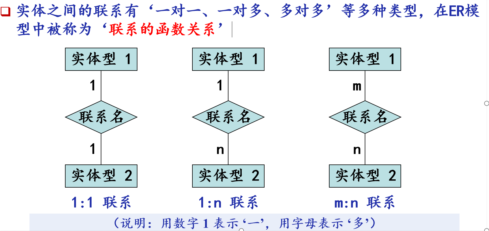
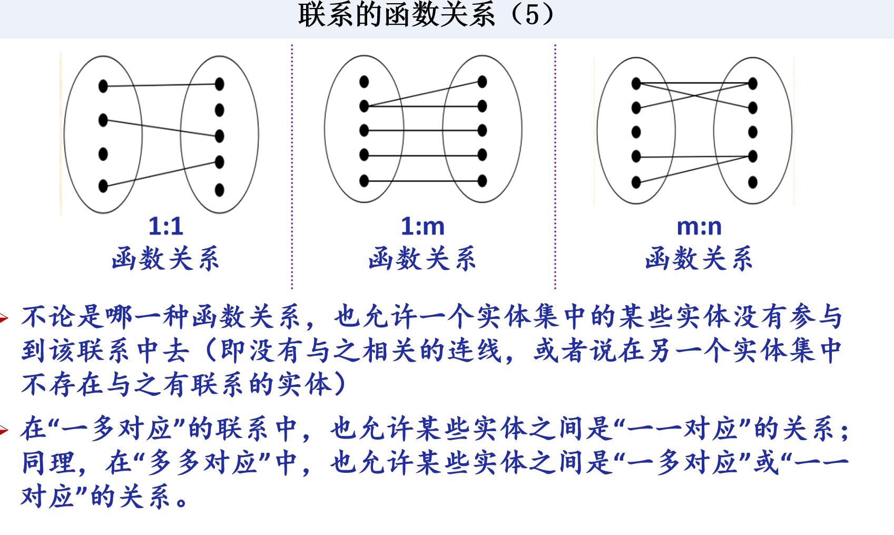

**实体内部的联系**：指同一个实体集中不同实体之间的联系，也有"一对一、一对多、多对多"等多种类型。例：职工"领导"关系（1:n）。

### 1.2.3 实体-联系方法（E-R方法）

实体-联系方法（Entity-Relationship Approach）：用**E-R图**来描述现实世界的概念模型，也称E-R模型。

E-R模型中的三个基本概念及其图形化表示：
- 实体：矩形框，框内写实体名
- 属性：椭圆形，椭圆内写属性名，用线段与实体相连
- 联系：菱形框，框内写联系名，用线段与相关实体相连，并标注联系类型(1:1, 1:n, m:n)

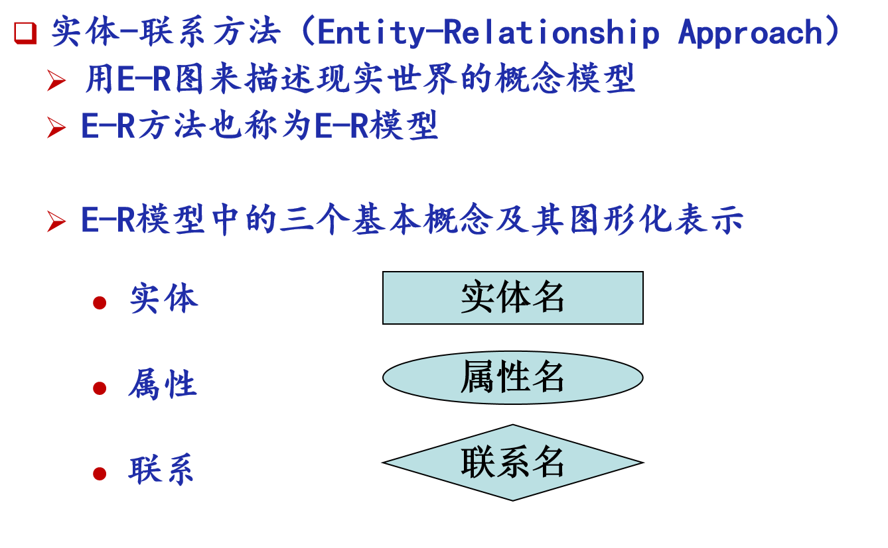
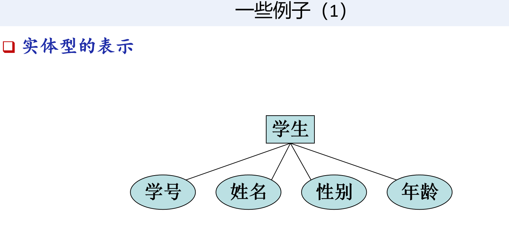
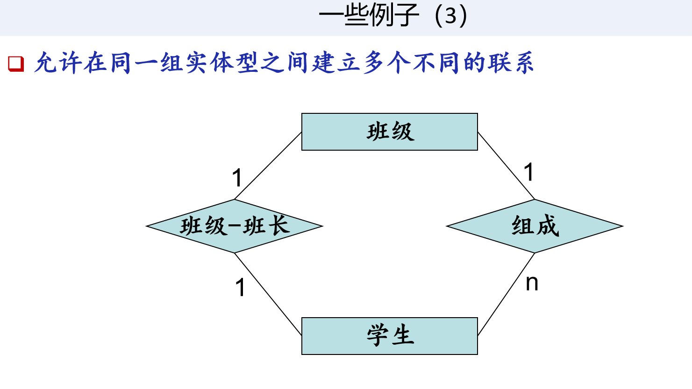

E-R图示例：
- 1:1联系：班级 - 班长
- 1:n联系：班级 - 组成 - 学生
- m:n联系：学生 - 选修 - 课程（联系上还可以有属性，如"成绩"）
- 允许在同一组实体型之间建立多个不同的联系（如班级与学生之间既有"组成"，又有"班长"联系）
- 多个实体型间的联系（如教师 - 讲授 - 课程，参考书也参与其中）

---

### 1.2.4 数据模型的组成要素

用于描述数据的组织结构，定义在该数据结构上可以执行的操作，以及数据之间必须满足的约束条件。
数据模型的组成要素包括：
- 数据结构
- 数据操作
- 数据约束

#### 数据结构
数据模型的数据结构：描述数据库的组成对象，以及对象之间的联系。数据结构是对**系统静态特性**的描述。
- 描述的内容：与对象的类型、内容、性质有关；与数据之间联系有关
- 数据结构是一个数据模型的基础，数据操作与数据约束均是建立在相应的数据结构上的
- 为了便于区别，数据模型中的数据结构被称为**数据模式** (data schema)
- 数据模式是划分不同类型数据模型的依据

#### 数据操作
数据操作：对数据库中各种对象（型）的实例（值）允许执行的操作的集合，包括操作及有关的操作规则。数据操作是对**系统动态特性**的描述。
- 数据操作的类型：查询、更新（包括插入、删除、修改）
- 数据模型对操作的定义：操作的确切含义、操作符号、操作规则（如优先级），实现操作的语言

#### 数据的完整性约束条件
数据的完整性约束条件：一组**完整性规则**的集合。
**完整性规则**：给定的数据模型中数据及其联系所具有的制约和依存规则，用以限定符合数据模型的数据库状态以及状态的变化，以保证数据的正确、有效和相容。

数据模型对完整性约束条件的定义：
- 反映和规定必须遵守的基本的通用的完整性约束条件
- 提供定义完整性约束条件的机制，以反映具体应用所涉及的数据必须遵守的特定的语义约束条件

---

### 1.2.5 常用数据模型

- **格式化模型**
  - 层次模型（Hierarchical Model）：有向树结构
  - 网状模型（Network Model）：有向图（无环）
- **关系模型**（Relational Model）
- **对象模型**
  - 面向对象数据模型（Object Oriented Data Model）
  - 对象关系数据模型（Object Relational Data Model）
- **半结构化、非结构化**

#### 层次模型与网状模型（第一代数据库）

- **网状模型**：用有向图（Directed Graph，无环）表示，由Bachman的IDS系统奠定基础（1961，获1973年图灵奖）
- **层次模型**：用有向树（Directed Tree）表示，由IBM IMS系统奠定基础（1965-1970）

优点：为用户提供统一的数据管理工具，提供数据共享能力
缺点：受文件物理影响较大，数据模式构造烦琐，不利于推广

#### 关系模型

在用户观点下，关系模型中数据的逻辑结构是一张**二维表**，它由行和列组成。在关系模型中，符合特定约束条件的二维表被称为"**关系**"，表中的行和列被称为"元组"和"属性"。
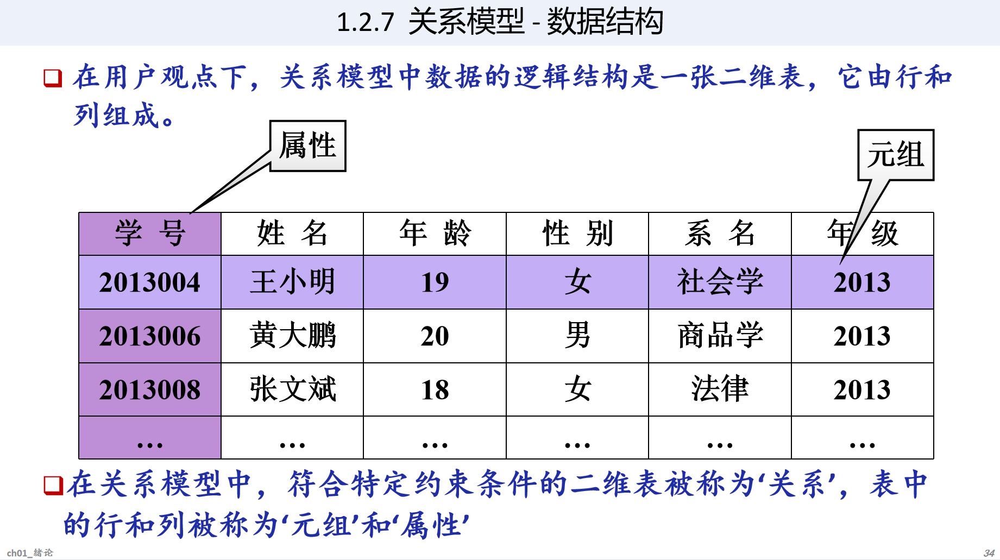
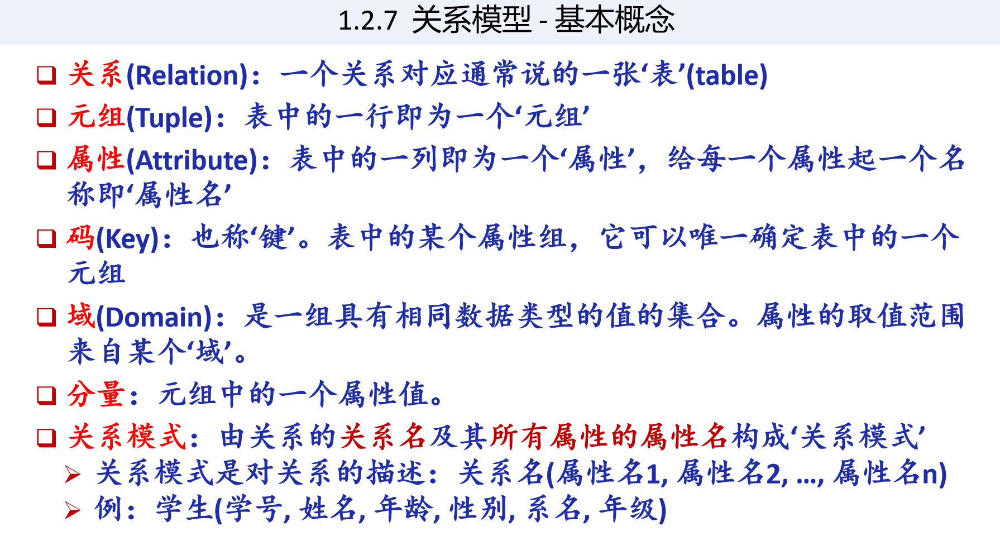

**基本概念**：
- **关系(Relation)**：一个关系对应通常说的一张"表"(table)
- **元组(Tuple)**：表中的一行即为一个"元组"
- **属性(Attribute)**：表中的一列即为一个"属性"，给每一个属性起一个名称即"属性名"
- **码(Key)**：也称"键"。表中的某个属性组，它可以唯一确定表中的一个元组
- **域(Domain)**：一组具有相同数据类型的值的集合。属性的取值范围来自某个"域"
- **分量**：元组中的一个属性值
- **关系模式**：由关系名及其所有属性的属性名构成，是对关系的描述：关系名(属性名1, 属性名2, ..., 属性名n)

例：学生(学号, 姓名, 年龄, 性别, 系名, 年级)

**规范化要求**：关系必须是规范化的，最基本的规范条件：关系的每一个分量必须是一个**不可分的数据项**，不允许表中还有表。

**数据操作与完整性约束**：
- 数据操作（查询、插入、删除、更新）是**集合操作**，操作对象和操作结果都是关系
- 数据操作的**非过程化**：存取路径对用户隐蔽，用户只要指出"干什么"，不必详细说明"怎么干"
- 关系的完整性约束条件：**实体完整性**、**参照完整性**、**用户定义的完整性**

**优缺点**：
- 优点：建立在严格的数学概念基础上；概念单一（实体和各类联系都用关系表示）；存取路径对用户透明，具有更高的数据独立性；简化了程序员工作
- 缺点：存取路径透明导致查询效率往往不如格式化数据模型；为提高性能，必须对查询请求进行优化，增加了DBMS开发难度

---

## 1.3 数据库系统的结构

从数据库应用开发人员角度看，数据库系统通常采用**三级模式结构**，是数据库系统内部的系统结构。
从数据库最终用户角度看，数据库系统的结构分为：单用户结构、主从式结构、分布式结构、客户-服务器、浏览器-应用服务器/数据库服务器多层结构等。

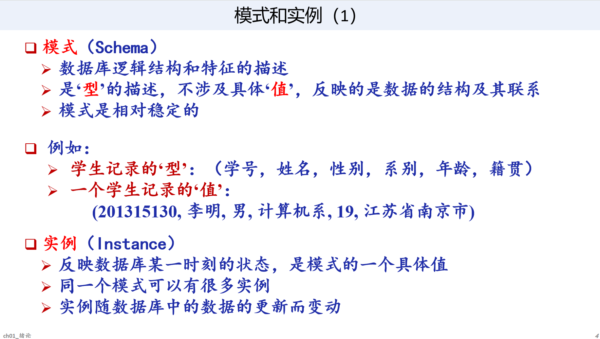
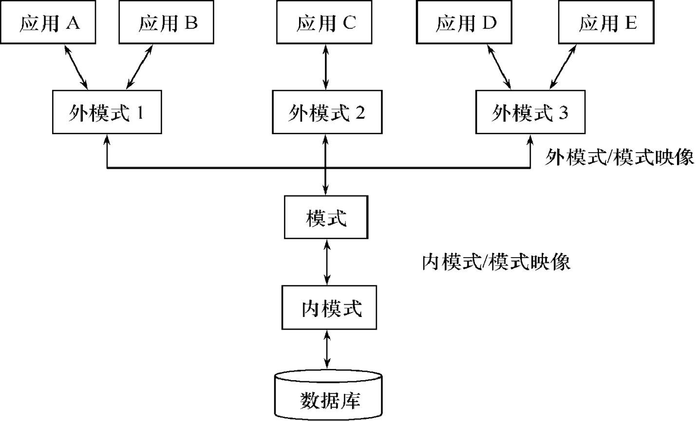
真正存在的只有内模式，其他都是逻辑上的模式

### 模式和实例

**模式（Schema）**：数据库逻辑结构和特征的描述。是"型"的描述，不涉及具体"值"，反映的是数据的结构及其联系。模式是相对稳定的。

**实例（Instance）**：反映数据库某一时刻的状态，是模式的一个具体值。同一个模式可以有很多实例，实例随数据库中的数据的更新而变动。

例：学生记录的"型"：（学号，姓名，性别，系别，年龄，籍贯）；一个学生记录的"值"：(201315130, 李明, 男, 计算机系, 19, 江苏省南京市)

### 三级模式结构

三级模式是对数据的三个抽象级别。
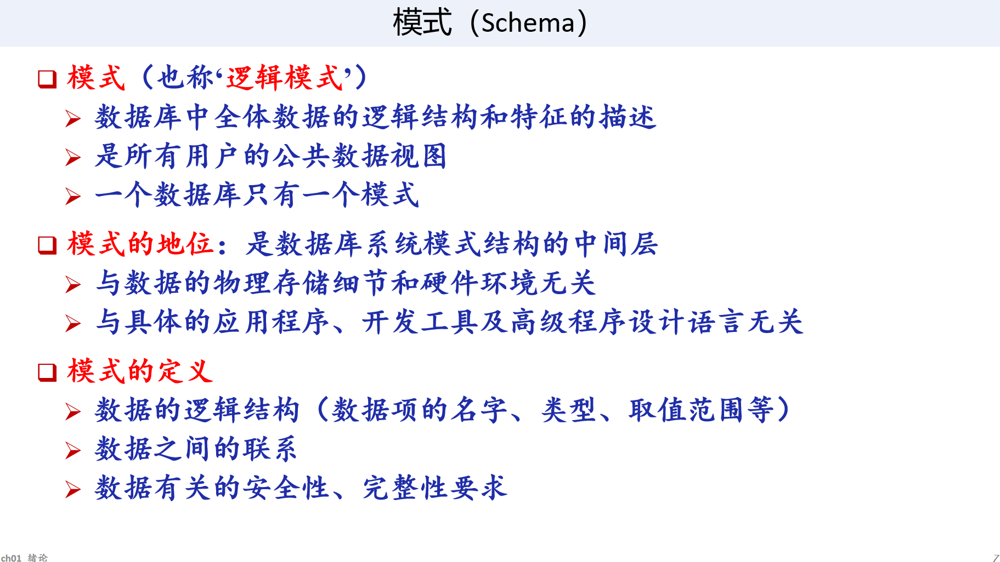

#### 外模式（External Schema）
也称"**子模式**"或"**用户模式**"。是对数据库用户（包括应用程序员和最终用户）使用的局部数据的逻辑结构和特征的描述。属于数据库用户的数据视图，是与某一应用有关的数据的逻辑表示。

外模式的地位：介于模式与应用之间
- 外模式通常是模式的子集
- **模式与外模式的关系：一对多**，一个数据库可以有多个外模式，反映了不同用户的应用需求、看待数据的方式、对数据保密的要求
- **外模式与应用的关系：一对多**，同一外模式也可以为某一用户的多个应用系统所使用，但一个应用程序只能使用一个外模式

外模式的用途：保证数据库安全性的一个有力措施，每个用户只能看见和访问所对应的外模式中的数据。

#### 模式（Schema）
也称"**逻辑模式**"。数据库中全体数据的逻辑结构和特征的描述，是所有用户的公共数据视图。一个数据库只有一个模式。

模式的地位：数据库系统模式结构的中间层。与数据的物理存储细节和硬件环境无关，与具体的应用程序、开发工具及高级程序设计语言无关。

模式的定义包括：数据的逻辑结构（数据项的名字、类型、取值范围等）、数据之间的联系、数据有关的安全性和完整性要求。

#### 内模式（Internal Schema）
也称"**存储模式**"或"**物理模式**"。是数据物理结构和存储方式的描述，是数据在数据库内部的表示方式。一个数据库只有一个内模式。

内模式包含：
- 记录的存储方式（如顺序存储、堆存储、hash存储等）
- 索引的组织方式
- 数据是否压缩存储
- 数据是否加密
- 数据存储记录结构的规定

### 二级映像与数据独立性

**二级映象**在数据库管理系统内部实现这三个抽象层次的**联系和转换**。

#### 外模式/模式映像
- 同一个模式可以有任意多个外模式；每一个外模式都有一个外模式/模式映象，定义外模式与模式之间的对应关系，映象定义通常包含在各自外模式的描述中
- **保证数据的逻辑独立性**：当模式改变时，DBA对外模式/模式映象作相应改变，使外模式保持不变，应用程序不必修改

#### 模式/内模式映像
- 定义了数据全局逻辑结构与存储结构之间的对应关系（说明逻辑记录和字段在内部的表示方式）
- 数据库中模式/内模式映象是唯一的，通常包含在模式描述中
- **保证数据的物理独立性**：当数据库的存储结构改变了，DBA修改模式/内模式映象，使模式保持不变，应用程序不受影响

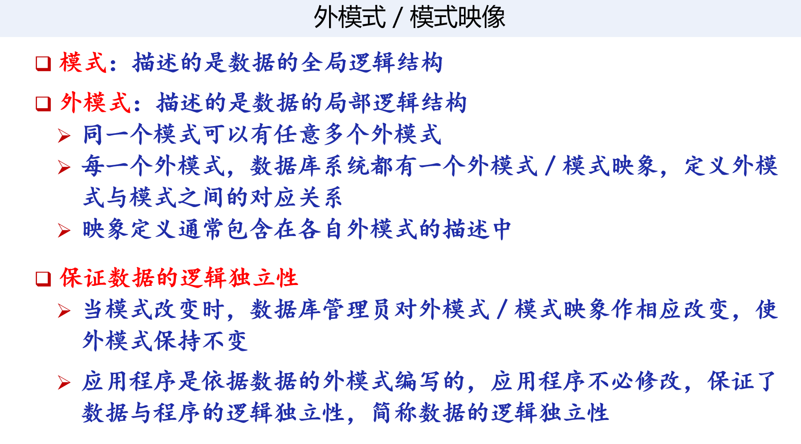
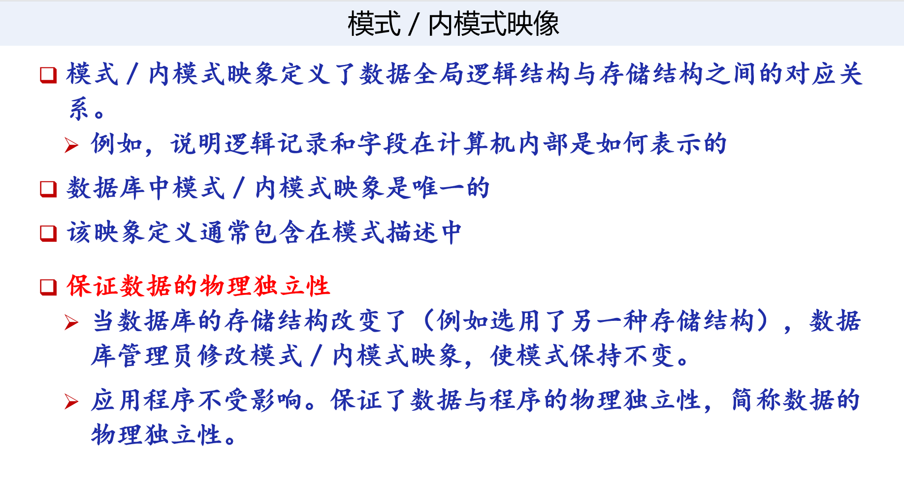
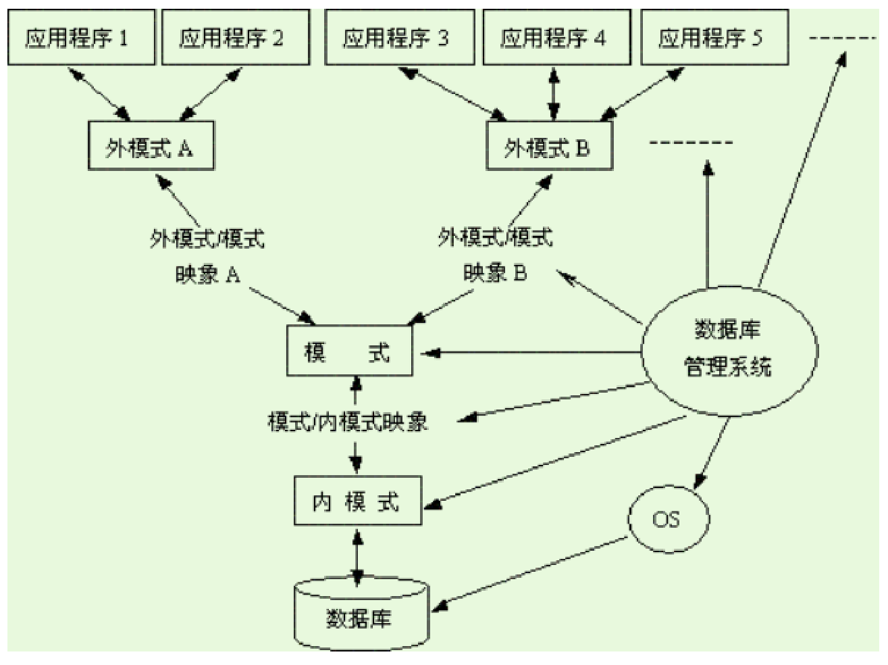

二级映像的意义：
- 保证了数据库外模式的稳定性，从底层保证了应用程序的稳定性
- 数据与程序之间的独立性，使得数据的定义和描述可以从应用程序中分离出去
- 简化了应用程序的编制，大大减少了应用程序的维护和修改

### 数据库系统的体系结构

- **两层C/S架构**：数据库和DBMS运行在数据库服务器中，数据库应用程序运行在客户机中，两者通过局域网实现数据访问
- **三层B/S架构**：数据库和DBMS运行在数据库服务器中，数据库应用程序运行在应用服务器（Web服务器）中，用户客户端只需要安装常用的浏览器，负责接收用户输入和结果展示

---

## 1.4 数据库系统的组成

### 硬件平台
数据库系统对硬件资源的要求：
- 足够大的内存
- 足够大的磁盘或磁盘阵列等设备
- 较高的通道能力，提高数据传送率

### 软件平台
- 数据库管理系统
- 支持DBMS运行的操作系统
- 与数据库接口的高级语言及其编译系统
- 以DBMS为核心的应用开发工具
- 为特定应用环境开发的数据库应用系统

### 人员

#### 数据库管理员（DBA）
- 决定数据库中的信息内容和结构
- 决定数据库的存储结构和存取策略
- 定义数据的安全性要求和完整性约束条件
- 监控数据库的使用和运行（系统故障恢复、介质故障恢复、监视审计文件）
- 数据库的改进和重组：性能监控和调优，定期对数据库进行重组织以提高系统性能，需求增加和改变时对数据库进行重构造

#### 系统分析员 / 数据库设计人员
- **系统分析员**：负责应用系统的需求分析和规范说明，与用户及DBA结合确定系统的硬软件配置，参与数据库系统的概要设计
- **数据库设计人员**：参加用户需求调查和系统分析，确定数据库中的数据，设计数据库各级模式

#### 应用程序员 / 最终用户
- **应用程序员**：设计和编写应用系统的程序模块，进行调试和安装
- **最终用户(End User)**：通过应用系统的用户接口使用数据库
  - **偶然用户**：不经常访问数据库，但每次访问时往往需要不同的数据库信息（企业或组织机构的高中级管理人员，一般通过软件工具访问）
  - **简单用户**：通过操作业务系统来使用（查询和更新）数据库中的数据（银行职员、机票预定人员等，不需要直接访问数据库）
  - **复杂用户**：工程师、科学家、经济学家等，直接使用数据库语言访问数据库，甚至能够基于DBMS的应用程序接口编制自己的应用程序
