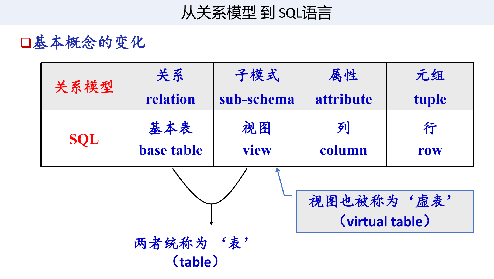
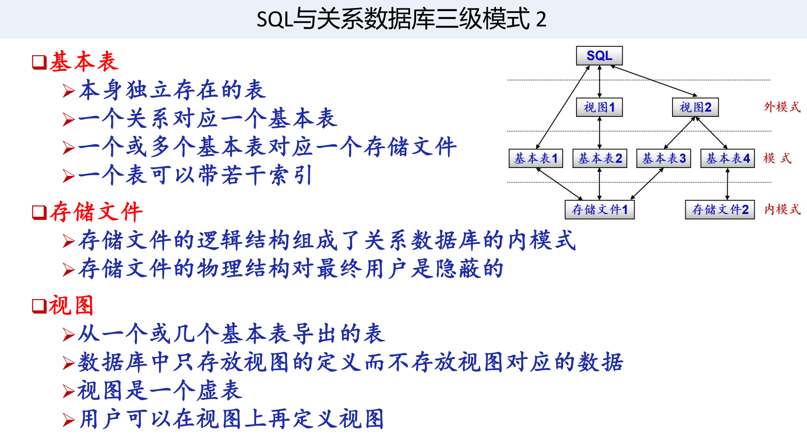
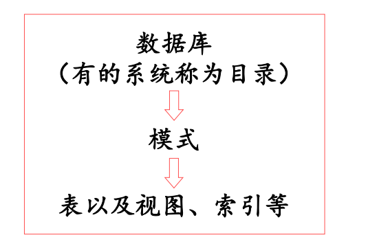
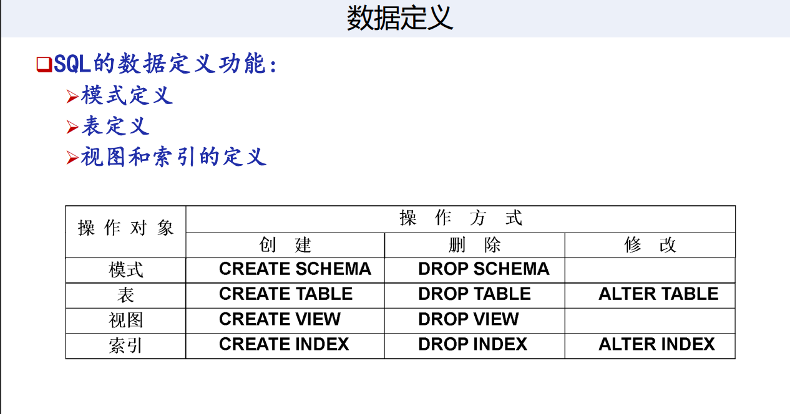
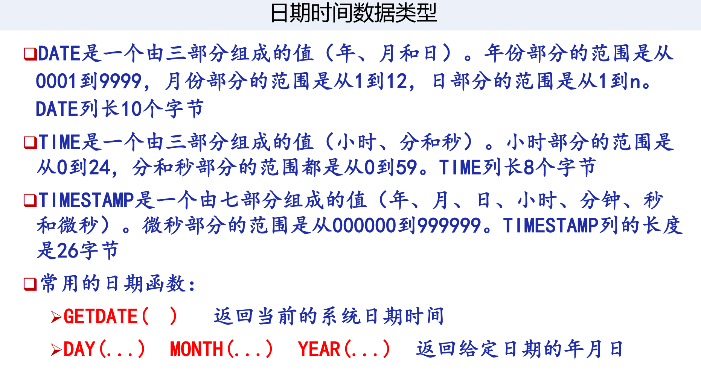
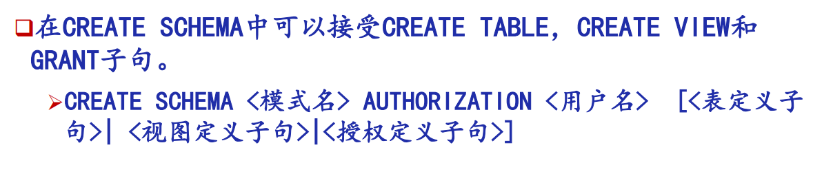
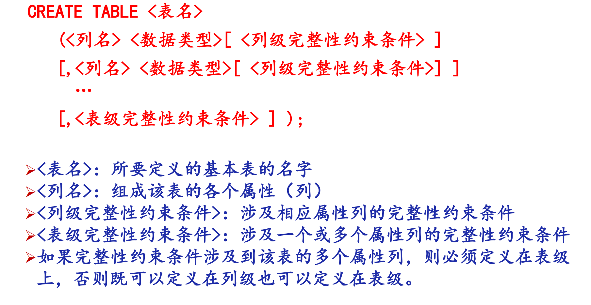
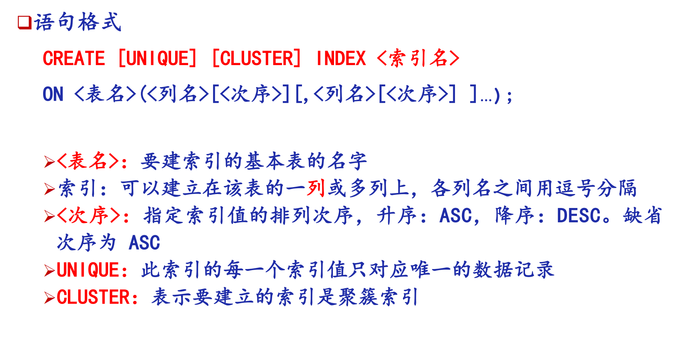

# 第3章 SQL

## 3.1 SQL 概述

SQL（Structured Query Language）是关系数据库的标准语言，集数据定义、查询、操纵、控制于一体。

**SQL 的特点：**
- 综合统一：DDL + DML + DCL 一体
- 高度**非过程化**：只说"做什么"，不说"怎么做"
- 面向**集合**的操作方式
- 以同一种语法结构提供两种使用方式（交互式 / 嵌入式）
- 语言简洁，易学易用




**SQL 功能分类：**

| 类别 | 功能 | 关键字 |
|------|------|--------|
| DDL | 数据定义 | CREATE, DROP, ALTER |
| DML | 数据操纵（查询+更新） | SELECT, INSERT, UPDATE, DELETE |
| DCL | 数据控制 | GRANT, REVOKE |

一条完整SQL语句，通常以命令动词开始，以分号';'作为结束符
在交互式SQL执行窗口中，可以一次只执行一条SQL语句，也可以一次执行多条SQL语句（批处理）
在批处理执行方式下，分号既作为前一条SQL语句的结束符，也可
以看做是不同SQL语句之间的分隔符

除常量外，SQL语言中的其他语言成分仅支持西文字符，且（字母）不区分大小写

保留字（关键字）
是 SQL 里“官方规定有特殊意义”的词，不能随便改意思。
例如：create、select、insert、alter、table、view、primary key、if、while。
它们用来表示“你要做什么操作”。

标识符
是你自己起的名字。
比如表名、列名、视图名、存储过程名、变量名。
例如 student、score、order_detail 这种。

常量
就是固定不变的值。
例如数字 100、字符串 “Tom”、日期 2026-04-09。



---

## 3.2 学生-课程数据库（示例库）

```sql
Student(Sno, Sname, Ssex, Sage, Sdept)
Course(Cno, Cname, Cpno, Ccredit)
SC(Sno, Cno, Grade)
```

- **Student**：学号、姓名、性别、年龄、所在系
- **Course**：课程号、课程名、先修课号、学分
- **SC**：学号、课程号、成绩（选课关系）

---

## 3.3 数据定义（DDL）
一个关系数据库管理系统的**实例**（Instance）中可以建立多个数据库
一个数据库中可以建立**多个模式**
一个模式下通常包括多个表、视图和索引等数据库对象


### 数据定义
对数据库中“数据的结构”进行规定和管理，而不是操作具体数据内容。


### **SQL 常用数据类型：**
SQL中域的概念用**数据类型**来实现，定义表的**属性**时需要指明其数据类型及长度

| 类型 | 说明 |
|------|------|
| CHAR(n) | 定长字符串 |
| VARCHAR(n) | 变长字符串 |
| INT / SMALLINT / BIGINT | 整数 |
| NUMERIC(p,d) / DECIMAL(p,d) | 精确小数，由p位数字组成，其中d位小数 |
| REAL| 单精度浮点数 |
| FLOAT(n) | 双精度浮点数 |
| DATE | 日期（YYYY-MM-DD） |
| TIME | 时间（HH:MM:SS） |
| TIMESTAMP | 日期时间（时间戳） |
| INTERVAL | 时间间隔 |



### 3.3.1 模式（Schema）

例子：
```sql
-- 为用户WANG定义一个学生-课程模式S-T
CREATE SCHEMA "S_T" AUTHORIZATION WANG;

-- 未定义模式名，默认使用授权用户的名字作为模式名
CREATE SCHEMA AUTHORIZATION WANG;

-- 为用户ZHANG创建了一个模式TEST，并且在其中定义一个表TAB1
CREATE SCHEMA TEST AUTHORIZATION ZHANG;
CREATE TABLE TAB1 ( COL1 SMALLINT,
COL2 INT,
COL3 CHAR(20),
COL4 NUMERIC(10,3),
COL5 DECIMAL(5,2),);

DROP SCHEMA <模式名> <CASCADE|RESTRICT>
-- CASCADE（级联）
-- ●删除模式的同时把该模式中**所有的数据库对象**全部删除
-- RESTRICT（限制）
-- ●如果该模式中定义了下属的数据库对象（如表、视图等），则**拒绝**该删除语句的执行。
-- ●仅当该模式中没有任何下属的对象时才能执行。
-- 删除模式
DROP SCHEMA ZHANG CASCADE;
```

### 3.3.2 基本表

**创建表：**

```sql
CREATE TABLE Student (
    Sno   CHAR(9)  PRIMARY KEY, --Sno是主码
    Sname CHAR(20) UNIQUE, --Sname取值唯一，unique约束
    Ssex  CHAR(2),
    Sage  SMALLINT,
    Sdept CHAR(20)
);

CREATE TABLE Course (
    Cno    CHAR(4)  PRIMARY KEY,
    Cname  CHAR(40) NOT NULL, -- Coursename不能为空
    Cpno   CHAR(4), -- 先修课号，允许空值（无先修课）
    Ccredit SMALLINT, -- SMALLINT 取值范围 -32768~32767
    FOREIGN KEY (Cpno) REFERENCES Course(Cno)  -- 自参照，Cpno是外码，参照Cno这一列
);

-- 学生选课表（复合主键，外码参照 Student 和 Course）
CREATE TABLE SC (
    Sno   CHAR(9),
    Cno   CHAR(4),
    Grade SMALLINT,
    PRIMARY KEY (Sno, Cno),       -- 复合主键
    /* 表级完整性约束条件，Sno是外码，被参照表是Student */
    FOREIGN KEY (Sno) REFERENCES Student(Sno),
    /* 表级完整性约束条件，Cno是外码，被参照表是Course */
    FOREIGN KEY (Cno) REFERENCES Course(Cno)
);
```

**修改表：**

```sql
ALTER TABLE Student ADD S_entrance DATE;           -- 增加列
ALTER TABLE Student ALTER COLUMN Sage INT;         -- 修改列数据类型
ALTER TABLE Course ADD UNIQUE(Cname);              -- 增加约束，约束Cname取值唯一
```

**删除表：**

```sql
DROP TABLE Student CASCADE;   -- 级联删除（含相关视图、索引等）
DROP TABLE Student RESTRICT;  -- 若有依赖则拒绝
```

### 3.3.3 索引

索引加速查询，但增加存储开销及维护代价。

```sql
-- 创建索引
CREATE UNIQUE INDEX Stusno ON Student(Sno); -- 指定唯一索引，Sno取值唯一，按学号升序建唯一索引
CREATE UNIQUE INDEX Coucno ON Course(Cno);
CREATE UNIQUE INDEX SCno   ON SC(Sno ASC, Cno DESC); -- 指定对这个表的多列索引，且指定升序/降序，ASC 升序（默认），DESC 降序
CREATE CLUSTER INDEX Stusname ON Student(Sname);  -- 聚簇索引

-- 删除索引
DROP INDEX Stusno;
```

- **UNIQUE**：唯一索引，不允许重复值
- **CLUSTER**：聚簇索引，按索引键顺序物理存储，每张表只能建一个

---

## 3.4 数据查询（SELECT）

### SELECT 通用语法

```sql
SELECT [ALL | DISTINCT] <目标列表达式>, ...
FROM   <表名或视图名>, ...
[WHERE <条件表达式>]
[GROUP BY <列名> [HAVING <条件>]]
[ORDER BY <列名> [ASC | DESC]];
```

**执行顺序：** FROM → WHERE → GROUP BY → HAVING → SELECT → ORDER BY

---

### 3.4.1 目标子句
SELECT [distinct] column-name-list | expressions | *
定义生成结果表时目标列的**投影方式**（显示哪些列，以什么方式显示）
[distinct]可选的去重，表示重复行只保留一条
column-name-list 只选指定列
expressions 选表达式结果
* 选全部列

#### 基本查询

```sql
-- 查询所有列
SELECT * FROM Student;

-- 查询指定列
SELECT Sno, Sname FROM Student;

-- 消除重复行
SELECT DISTINCT Sno FROM SC;

-- 列别名
SELECT Sname AS 姓名, 2014-Sage AS 出生年份 FROM Student;
```

### 3.4.2 范围子句
FROM tablename { , tablename ...}
指定操作对象
可以在FROM子句中对一个表重新命名（即定义一个别名 alias），只在这一句语句里面有效：
`<table_name> <alias_name>`
```sql
SELECT Sname, Sdept FROM Student AS S; -- 把Student重命名为S
```

### 3.4.3 条件子句

WHERE search_condition
是可选成分，用于定义查询条件

在FROM子句中给出的表只是表明此次查询需要访问这些表，它们之间是通过笛卡儿积运算进行合并的；
如果需要执行它们之间的$\theta$-连接或自然连接运算，则需要在WHERE子句中显式地给出它们的连接条件。

```sql
-- LIKE 模糊查询（ESCAPE 定义转义字符）
SELECT Cno, Ccredit FROM Course WHERE Cname LIKE 'DB\_Design' ESCAPE '\';

-- 范围查询
SELECT Sname, Sdept, Sage FROM Student WHERE Sage BETWEEN 20 AND 23;

-- 集合查询
SELECT Sname, Ssex FROM Student WHERE Sdept IN ('CS','MA','IS');
```
